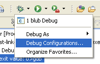

===============
STM32 IDE HowTo
===============

Pre Requirements
----------------

 * Install the Java JRE (http://www.java.com/download/)
 * Get Eclipse Helios (http://www.eclipse.org/downloads/)
 * Get the Yagarto toolchain (http://www.yagarto.de/)

Set up GNU ARM Eclipse Plug-in
------------------------------

Needed to get a nice interface for setting the CPU type, compiler and linker
options etc.

`Help -> Install New Software`

.. image:: img/install_menu.png

`Add -> Location`: http://gnuarmeclipse.sourceforge.net/updates

In case it's slow, untick "Check All Servers".

.. image:: img/arm_tools.png

Set up Hardware Debugging
-------------------------

Help -> Install New Software

Add -> http://download.eclipse.org/tools/cdt/releases/helios

Select `C/C++ GDB Hardware Debugging`

.. image:: img/hardware_debugger.png

Set up the Toolchain
--------------------

First the toolchain needs to be added to the current path. In this case the
following folder structure was choosen:

.. image:: img/tree.png

The following code in a bat file adds the toolchain to the path and starts
Eclipse independed of the current path::

    set PATH=%PATH%;%CD%\ide\yagarto-toolchain\bin;%CD%\ide\yagarto-tools\bin
    ide\eclipse\eclipse.exe

Set up a new Project
--------------------

`File -> New -> Project`

`ARM Cross Target Application -> Empty Project -> Yagarto`

.. image:: img/new_project.png

Now we need to set up GDB debugging.

Switch Elcipse to Debug mode, first the server.

`Run -> External Tools -> External Tools Configuration` or click on the toolbar
button shown below.

.. image:: img/server.png

Location needs to be the ST-Link GDB server taken from Atollic. It's a
modified GDB Server that includes a driver for ST-Link.

Arguments (taken from Atollic as well): `-e -d -l 31 -p 61234 -v -r 15`

This could be started without Eclipse, but this way it is a one click
operation and Eclipse will watch the process, show debug output and notify
in case the process crashes.

.. image:: img/server_config.png

Now the client. `Run -> Debug Configurations...` or the button shown below.

Add a new `GDB Hardware Debugging` entry and switch to `Debugger`.

`GDB Command` needs to be the toolchains gdb executable. In this case it's
`arm-none-eabi-gdb.exe` since yagarto is in the current path.

.. image:: img/client_config.png

