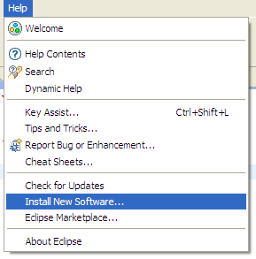
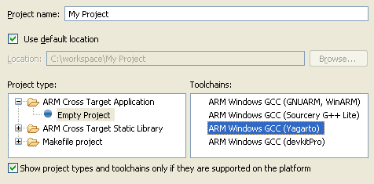
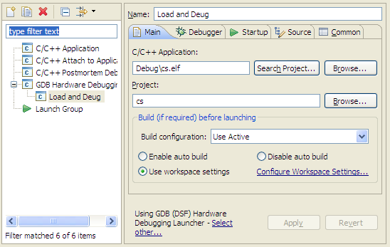
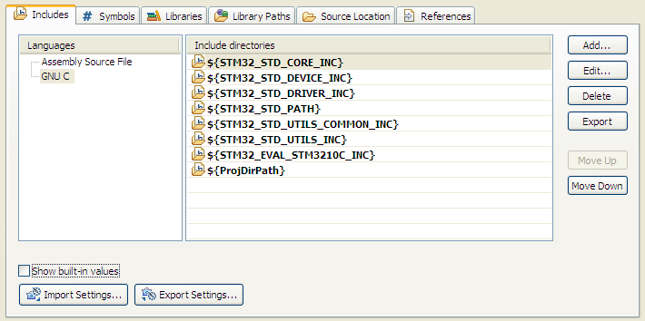

===============
STM32 IDE HowTo
===============

Pre Requirements
----------------

 * Install the Java JRE (http://www.java.com/download/)
 * Get Eclipse Helios (http://www.eclipse.org/downloads/)
 * Get the Yagarto toolchain (http://www.yagarto.de/)

Set up GNU ARM Eclipse Plug-in
------------------------------

Needed to get a nice interface for setting the CPU type, compiler and linker
options etc.

`Help -> Install New Software`

`Add -> Location`: http://gnuarmeclipse.sourceforge.net/updates

In case it's slow, untick "Check All Servers".

.. image:: img/arm_tools.png

Set up Hardware Debugging
-------------------------

Help -> Install New Software

Add -> http://download.eclipse.org/tools/cdt/releases/helios

Select `C/C++ GDB Hardware Debugging`

.. image:: img/hardware_debugger.png

Set up the Toolchain
--------------------

First the toolchain needs to be added to the current path. In this case the
following folder structure was choosen:

.. image:: img/tree.png

The following code in a bat file adds the toolchain to the path and starts
Eclipse independed of the current path::

    set PATH=%PATH%;%CD%\ide\yagarto-toolchain\bin;%CD%\ide\yagarto-tools\bin
    ide\eclipse\eclipse.exe

Get the Standard Peripheral Library
-----------------------------------

The file is a bit hard to find on the website.. so here is a small description:

http://www.st.com/

`Support -> Tools & Resources -> Runtime Software -> STM32 ->
ARM-based 32-bit MCU STM32F10xxx standard peripheral library`

Set up a new Project
--------------------

`File -> New -> Project`

`ARM Cross Target Application -> Empty Project -> Yagarto`

Now we need to set up GDB debugging.

Switch Elcipse to Debug mode, first the server.

`Run -> External Tools -> External Tools Configuration` or click on the toolbar
button shown below.

.. image:: img/server.png

Location needs to be the ST-Link GDB server taken from Atollic. It's a
modified GDB Server that includes a driver for ST-Link.

Arguments (taken from Atollic as well): `-e -d -l 31 -p 61234 -v -r 15`

This could be started without Eclipse, but this way it is a one click
operation and Eclipse will watch the process, show debug output and notify
in case the process crashes.

.. image:: img/server_config.png

Now the client. `Run -> Debug Configurations...` or the button shown below.

.. image:: img/client.png

Add a new `GDB Hardware Debugging` entry and switch to `Debugger`.

`GDB Command` needs to be the toolchains gdb executable. In this case it's
`arm-none-eabi-gdb.exe` since yagarto is in the current path.

Cofigure the toolchain
----------------------

Now we need to define the include paths for the peripheral standard library.
Because there is no reason to edit this library it is placed under the
`libraries` directory and not included in the project.

The start.bat file defines 2 environment variables for include paths (it
seems eclipse does not understand lists, so they are separate)::

    set STM32_STD_PATH=%CD%\libraries\stm32f10x_stdperiph_lib
    set STM32_STD_CORE_INC=%STM32_STD_PATH%\Libraries\CMSIS\CM3\CoreSupport
    set STM32_STD_DEVICE_INC=%STM32_STD_PATH%\Libraries\CMSIS\CM3\DeviceSupport\ST\STM32F10x
    set STM32_STD_DRIVER_INC=%STM32_STD_PATH%\Libraries\STM32F10x_StdPeriph_Driver\inc

    set STM32_STD_UTILS_INC=%STM32_STD_PATH%\Utilities\STM32_EVAL
    set STM32_STD_UTILS_COMMON_INC=%STM32_STD_PATH%\Utilities\STM32_EVAL\Common
    set STM32_EVAL_STM3210C_INC=%STM32_STD_PATH%\Utilities\STM32_EVAL\STM3210C_EVAL
    set STM32_EVAL_STM3210B_INC=%STM32_STD_PATH%\Utilities\STM32_EVAL\STM3210B_EVAL
    set STM32_EVAL_STM32100B_INC=%STM32_STD_PATH%\Utilities\STM32_EVAL\STM32100B_EVAL
    set STM32_EVAL_STM32100E_INC=%STM32_STD_PATH%\Utilities\STM32_EVAL\STM32100E_EVAL
    set STM32_EVAL_STM3210E_INC=%STM32_STD_PATH%\Utilities\STM32_EVAL\STM3210E_EVAL

To add the paths to the project go to `Project -> Properties -> C/C++ General
-> Paths and Symbols -> Includes`, select `GNU C`, `All configurations`
and add the two paths using the `Add...` button.

The standard peripheral library needs one define before it can be included
(using `#include <stm32f10x.h>`).

One of the following variables has to be defined to specify the chip:

 * STM32F10X_LD
 * STM32F10X_LD_VL
 * STM32F10X_MD
 * STM32F10X_MD_VL
 * STM32F10X_HD
 * STM32F10X_HD_VL
 * STM32F10X_XL
 * STM32F10X_CL

Either in the source before the include or using the project properties
that can be found under `Project -> Properties -> C/C++ General -> Paths
and Symbols -> Symbols`. Select `GNU C`, `All configurations` and add the
define using the `Add...` button.

.. image:: img/symbol.png
