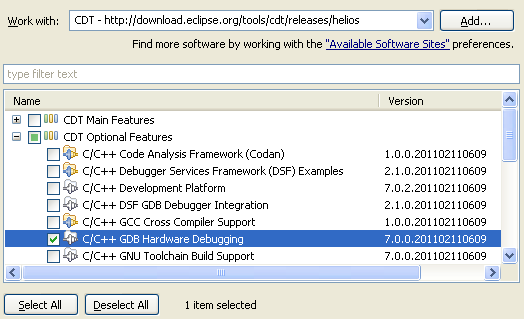

===============
STM32 IDE HowTo
===============

Setting up the IDE + toolchain
------------------------------

**You should not have to do this.**
There is a finished IDE + toolchain on the AFS server (under SW/stm32lib).

 * Install the Java JRE (http://www.java.com/download/)
 * Get Eclipse Helios (http://www.eclipse.org/downloads/)
 * Get the Codesourcery toolchain (http://www.codesourcery.com/sgpp/lite/arm/download.html)

Setting up GNU ARM Eclipse Plug-in
==================================

Needed to get a nice interface for setting the CPU type, compiler and linker
options etc.

`Help -> Install New Software`

.. image:: img/install_menu.png

`Add -> Location`: http://gnuarmeclipse.sourceforge.net/updates

In case it's slow, untick "Check All Servers".

.. image:: img/arm_tools.png

Setting up Hardware Debugging
=============================

Help -> Install New Software

Add -> http://download.eclipse.org/tools/cdt/releases/helios

Select `C/C++ GDB Hardware Debugging`

Getting the Standard Peripheral Library
=======================================

The file is a bit hard to find on the website.. so here is a small description:

http://www.st.com/

`Products -> Micors & Memories -> Microcontrollers -> STM32 -> Resources -> Software Resources -> Firmware`

**Important:** You have to change all file extensions under
`Libraries/CMSIS/CM3/DeviceSupport/ST/STM32F10x/startup` to uppercase (.S) or
eclipse will not recognize them as assembler files.

Description of the existing IDE + toolchain package
---------------------------------------------------

There are two main batch files in the main dir. `start_eclipse.bat` which sets
the right environment variables and starts eclipse is probably all you need.

Linker scripts
==============

`generate_linker_scripts.bat` uses the GCC compiler in preprocessor only
mode, to generate linker scripts for all available STM32 chips. The linker
script template can be found under `linker_scripts/stm32_flash.ld.in`. All
linker scripts will be saved under `linker_scripts`.

Manuals
=======

The `manuals` directory includes various manuals.

Toolchain
=========

`codesourcery-toolchain` includes the toolchain. First the yatargo toolchain
was used, but it failed to include debug symbols in the elf file (could have
been an error on my side) which prevented proper debugging.

ST-Link GDB Server
==================

The `st-link-gdb-server` directory includes the modified gdb server taken from
the Atollic toolchain. It includes a driver for the ST-LINK.

 * ST-LINK_gdbserver.exe is taken from Atollic 2.2
 * STLinkUSBDriver.dll from an older version (newer ones need a WinVista
   or an extra driver that is also shipped with Attolic)

The ST-LINK device uses an uncommon way for talking with the PC. It's
implemented by directly writing to the mounted pseudo filesystem. Since this
is completely different from other programmers it is unlikely that it will ever
be supported by free alternatives like openocd (according to the mailing list)

(Also the pseudo FS fails to mount most of the times under linux)

Libraries
=========

The library directory includes the standard peripheral library.

 * `Libraries/CMSIS`: The Cortex Microcontroller Software Interface Standard.
   Don't try to update the CMSIS to the newest version! The included one
   is a modified version which includes many more functions. The basic
   CMSIS library only includes function, which all CMSIS compatible libraries
   must support.
 * `Libraries/STM32F10x_StdPeriph_Driver`: Includes various functions for
   accessing the STM peripherials.
 * `Project`: Various example projects.
 * `Utilities`: Includes drivers for all the eval boards.(LCD etc.)

Creating a project
------------------

Execute `start_eclipse.bat`.

New Project
===========

`File -> New -> Project`

`ARM Cross Target Application -> Empty Project -> Sourcery G++ Lite`

.. image:: img/new_project.png

Adding a launcher for the GDB server
====================================

Switch Elcipse to Debug mode. `Run -> External Tools -> External Tools
Configuration` or click on the toolbar button shown below.

.. image:: img/server.png

This could be started without Eclipse, but this way it is a one click
operation and Eclipse will watch the process, show debug output and notify
in case the process crashes.

.. image:: img/server_config.png

Arguments: `-e -d -l 0 -p 61234 -r 15`

Adding a Debug Launcher
=======================

`Run -> Debug Configurations...` or the button shown below.

.. image:: img/client.png

Add a new `GDB Hardware Debugging` entry and switch to `Debugger`.

.. image:: img/client_config.png

`GDB Command` needs to be the toolchains gdb executable. In this case it's
`arm-none-eabi-gdb.exe` since codesourcery is in the current path.

Under `startup` you can set a breakpoint at main and check `resume` so the
code will be started and will pause at main (otherwise it would start in
the reset handler)

If you want to start debugging without writing the program to the controller
add another debug launcher with `load image` and `load symbols` unchecked.

Info: Setting many breakpoints will slow down debugging (takes forever
to load the flash image etc.). Try to keep the number of breakpoints low.

Configuring the toolchain
=========================

`Project -> Properties -> C/C++ Build -> Settings - > C Compiler ->
Optimization`

Set `Function sections` and `Data sections`. This will tell the compiler
to split everything in separate sections. Together with the linker
optimizations this can lead to image size reductions.

`Project -> Properties -> C/C++ Build -> Settings - > C Linker -> General`

Specify the right linker script. There should be a linker script under
`linker-scripts` for every chip. In case the directory is empty, execute
`generate_linker_scripts.bat`.

`--gc-sections` will enable removing of unused sections produced by the
compiler settings above (These three options are the dead code removal in
Atollic)

Under `Project -> Properties -> C/C++ Build -> Behavior` you can enable
parallel make (make -j).

Include Paths, Source Paths and Symbols
=======================================

FIXME

 * STM32F10X_LD
 * STM32F10X_LD_VL
 * STM32F10X_MD
 * STM32F10X_MD_VL
 * STM32F10X_HD
 * STM32F10X_HD_VL
 * STM32F10X_XL
 * STM32F10X_CL

`USE_STDPERIPH_DRIVER`, `USE_STM3210C_EVAL`

.. image:: img/includes.png

